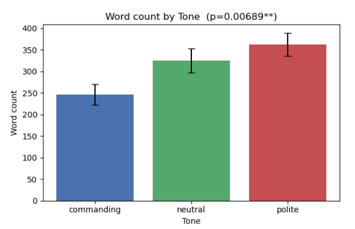
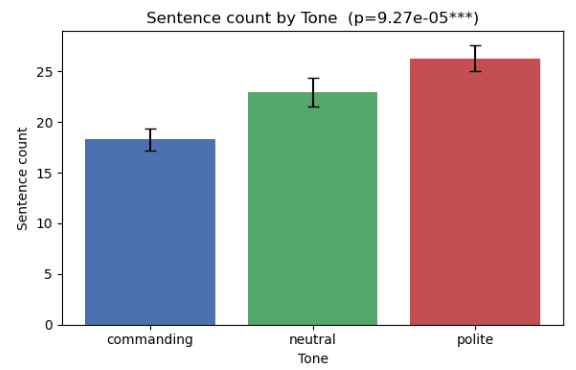
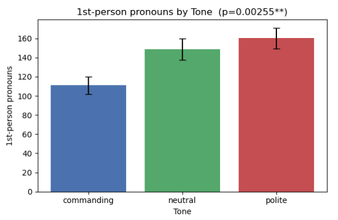
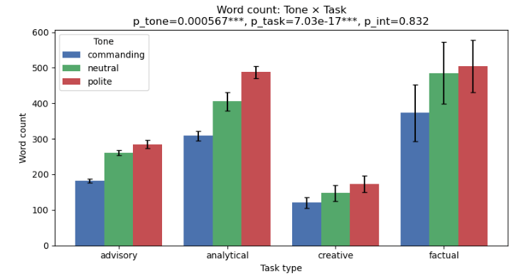
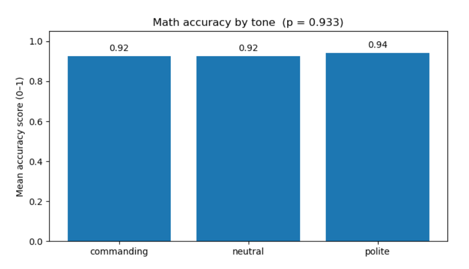

# Should We Be Polite to ChatGPT?  
Exploring how different user tones affect ChatGPT responses.

---

## 1. Project Overview

This project studies whether the **tone** of a user’s prompt changes how a large language model responds.

We focus on three tones:

- **Polite** – e.g., “Hi there, could you please… Thank you so much!”
- **Neutral** – direct instructions
- **Commanding** – e.g., “… I need you to do this immediately.”

We ask:

1. Does tone change the **style** of responses (length, structure, sentiment)?
2. Does tone change how **social** the model sounds (hedging, first-person pronouns)?
3. Does tone change **factual / math accuracy**?

All experiments are run with **gpt-4.1-mini** via the OpenAI API.

---

## 2. Repository Structure

```text
.
├── run_gpt.py                               # Script to call GPT and collect responses
├── analyze_responses.py                     # Script to score responses and summarize metrics
├── llm_politeness_responses.csv             # Raw responses (one row per model call)
├── llm_politeness_responses_scored.csv      # With sentiment, counts, math accuracy, etc.
├── llm_politeness_summary_by_tone_task.csv  # Aggregated by tone × task type
├── figures/
│   ├── word_count_by_tone.png
│   ├── sentiment_count_by_tone.png
│   ├── modal_verbs.png
│   ├── 1st_person.png
│   ├── taskxtone.png
│   └── math_accuracy.png
└── README.md
```

---

## 3. Experimental Design

### 3.1 Model & Settings

- Model: `gpt-4.1-mini`  
- Temperature: `0.7`  
- Each call is one-shot (no conversation history).

### 3.2 Tone Conditions (3)

We wrap each base task in one of three prompt templates:

- **Polite**  
  > “Hi there! If it isn’t too much trouble, could you please {content}? I would really appreciate your help. Thank you so much!”

- **Neutral**  
  > “{content}”

- **Commanding**  
  > “{content} I need you to do this immediately. Do not delay.”

Here `{content}` is the underlying task description (e.g., “explain how photosynthesis works”).

### 3.3 Task Types (4)

We design four task categories, each with 5 base prompts:

1. **Analytical** – explain or analyze economic / technical questions.  
2. **Factual** – knowledge questions plus several **math / time-series econometrics** problems.  
3. **Advisory** – study, career, and life advice.  
4. **Creative** – short stories, poems, scenes.

### 3.4 Full Design

- 4 task types  
- 5 prompts per task type  
- 3 tones (polite / neutral / commanding)  
- 3 independent runs per `(task_type, tone, prompt)` combination

Total number of model calls:

> 4 × 5 × 3 × 3 = **180 responses**

The script `run_gpt.py` iterates over all combinations, calls the OpenAI API, and stores each response as one row in `llm_politeness_responses.csv` (including metadata such as task type, tone, prompt index, and run index).

---

## 4. Scoring & Features (analyze_responses.py)

The script `analyze_responses.py` loads `llm_politeness_responses.csv` and computes a set of linguistic and accuracy features.

### 4.1 Length & Readability

For each response we compute:

- **Word count** – total tokens separated by whitespace.  
- **Sentence count** – number of sentence-like segments.  
- **Average sentence length** – words per sentence.  
- **Flesch Reading Ease** – standard readability index (higher = easier to read).

### 4.2 Sentiment & Style

- **VADER sentiment** – compound sentiment score in [−1, 1].  
- **Modal verbs** – counts of “can, could, should, might, would, may, must, will…”.  
- **Hedging words** – counts of terms like “maybe, perhaps, possibly, generally, often” that soften claims.  
- **First-person pronouns** – counts of “I, me, my, we, our”.

These features are used to quantify how “cautious”, “social”, or “relational” the model sounds under different tones.

### 4.3 Factual / Math Accuracy

For factual prompts that are math / econometrics questions, we manually score:

- **`math_accuracy`** – a value in `[0, 1]` indicating whether the solution is correct or mostly correct.

### 4.4 Output Files

`analyze_responses.py` writes:

- `llm_politeness_responses_scored.csv`  
  – one row per response, with all computed features.

- `llm_politeness_summary_by_tone_task.csv`  
  – aggregated means and standard errors, grouped by `tone` and `task_type`, used to generate the plots in `figures/`.

---

## 5. Statistical Analysis

To understand how tone and task type influence different metrics, we perform two-way ANOVA–style comparisons with:

- Factor A: **Tone** (polite, neutral, commanding)  
- Factor B: **Task type** (analytical, factual, advisory, creative)

For each metric \(Y\) (e.g., word count, modal verbs, math accuracy) we examine:

1. **Main effect of Tone**  
   - Does changing tone (polite vs neutral vs commanding) significantly change the mean of \(Y\)?

2. **Main effect of Task Type**  
   - Do different task types naturally produce different values of \(Y\)?

3. **Tone × Task interaction**  
   - Does the effect of tone depend on task type?  
   - Example: tone might matter a lot for advisory responses but much less for factual ones.

The plots report p-values as:

- `p_tone` – main effect of tone  
- `p_task` – main effect of task type  
- `p_int` – interaction between tone and task type

---

## 6. Results

### 6.1 Length: Polite Prompts Elicit Longer Responses



- **Polite** prompts produce the longest responses, **commanding** the shortest, with **neutral** in between.  
- Word count and sentence count both show significant tone effects (p-values ≪ 0.01).  
- Average sentence length is similar across tones, so polite responses are longer mainly because they contain **more sentences**, not because each sentence is much longer.

### 6.2 Sentiment: Slight Differences but Strong Positive Baseline



- VADER sentiment scores are positive for all tones, reflecting the model’s default friendly style.  
- Polite prompts are slightly more positive on average, but the difference is modest.  
- Even when the user is more direct or commanding, the model stays mostly positive and cooperative.

### 6.3 Social Style: Modal Verbs & First-Person Pronouns


- Polite > neutral > commanding in use of **modal verbs** such as “could”, “might”, “would”.  
- This pattern is statistically significant, indicating that polite prompts make the model phrase responses in a more tentative, cautious, and cooperative way.



- Polite prompts also increase the use of **first-person pronouns** (“I can help…”, “I would suggest…”).  
- This suggests that the model adopts a more relational, conversational stance when addressed politely.

### 6.4 Tone × Task Interaction



- Task type has a large main effect: factual and analytical responses are naturally longer and more complex than creative or advisory ones.  
- Tone still has a consistent effect within each task type: polite responses are usually longer and more hedged.  
- The interaction term is generally small, meaning the **direction** of tone effects is similar across tasks, though the **size** of the effect can vary.

### 6.5 Math Accuracy: Tone Does Not Help



- For difficult time-series econometrics questions, mean accuracy is around 0.92–0.94 for all tones.  
- The differences between polite, neutral, and commanding prompts are not statistically significant (p ≈ 0.93).  
- In this setting, being polite changes *how* the answer is phrased but does **not** make ChatGPT reliably more correct.

---

## 7. Key Takeaways

- **Tone clearly affects style.**  
  Polite prompts lead to longer answers, more modal verbs, more first-person pronouns, and slightly more positive sentiment.

- **Tone has limited impact on accuracy.**  
  For the math/econometrics questions in our dataset, politeness does not significantly change correctness.

- **LLMs show social mirroring without emotions.**  
  The model behaves as if it is aligning with human politeness norms—sounding more careful and relational when the user is polite—even though it has no internal feelings.

- **Task context matters, but patterns are consistent.**  
  Different tasks produce very different baseline lengths and styles, yet the relative effect of tone (polite > neutral > commanding in verbosity and hedging) is broadly similar across tasks.

---

## 8. Reproducing the Experiment

### 8.1 Set Your OpenAI API Key

**On macOS / Linux (bash / zsh):**
```bash
export OPENAI_API_KEY="your_api_key_here"
```

**On Windows (PowerShell):**
```powershell
setx OPENAI_API_KEY "your_api_key_here"
```

Make sure you restart the terminal or open a new one after setting the variable.

---

### 8.2 Generate Model Responses

```bash
python run_gpt.py
```

This script will call the OpenAI API for every `(task_type, tone, prompt, run)` combination and write:

- `llm_politeness_responses.csv`

---

### 8.3 Analyze Responses and Regenerate Summaries

```bash
python analyze_responses.py
```

This script will:

- compute all length, style, sentiment, and accuracy features  
- write `llm_politeness_responses_scored.csv`  
- aggregate results into `llm_politeness_summary_by_tone_task.csv`  
- (optionally) regenerate the plots in `figures/`

---

## 9. Authors 

- Arabella Wang  
- Claire Sun  
- Gary Zheng  

**Columbia Business School – Generative AI**  
Instructor: Tianyi Peng  
Semester: Fall 2025
